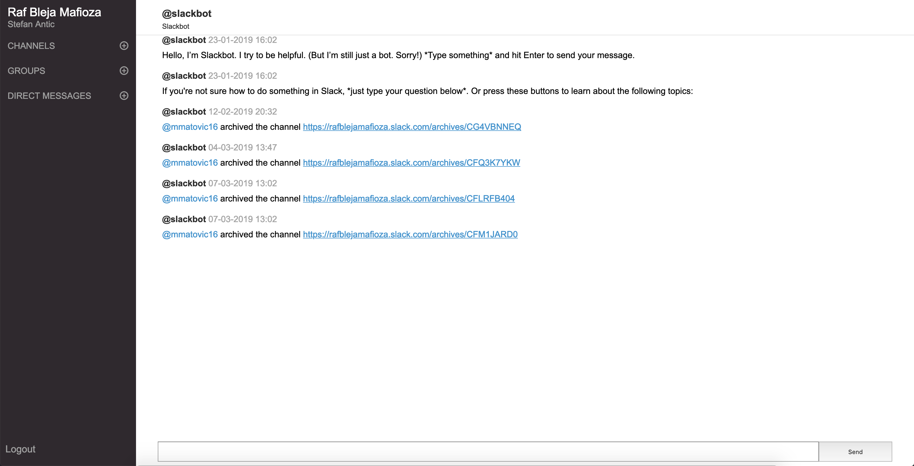

**Use Slack wherever & whenever you need or want to.**
# Optimized Slack app for slow internet connections
This project enables team/user to load only basic HTML view for Slack.

New way to use Slack on slow connections.



## Installation
Because this is a Laravel project, the suggestion is to use the `laravel/homestead` for virtualization.

`composer install` will install all dependencies and run:
```sh
php -r "file_exists('.env') || copy('.env.example', '.env');"
php artisan key:generate
touch database/database.sqlite
php artisan migrate
```

Create your new SlackApp, enter redirect URL and select Permission Scopes in Slack Dashboard:

Redirect URL (e.g.): http://slacktimizer.local/auth/slack/callback

Scopes:
- Access content in your public channels
- Access content in your private channels
- Access content in your direct messages
- Access your workspace’s profile information
- Send messages as you

In your `.env` file add your SlackApp credentials (Client ID and Client Secret) and Slack redirect URL:
```
SLACK_KEY=530_________.578_________
SLACK_SECRET=137d3d8986b9____________________
SLACK_REDIRECT_URI=http://slacktimizer.local/auth/slack/callback
```
